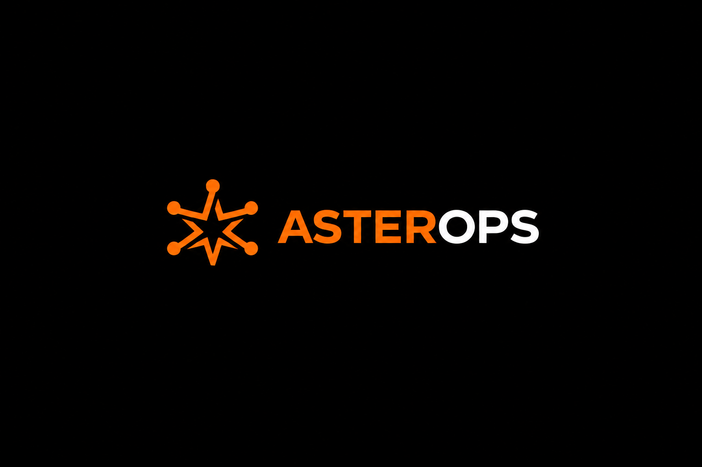
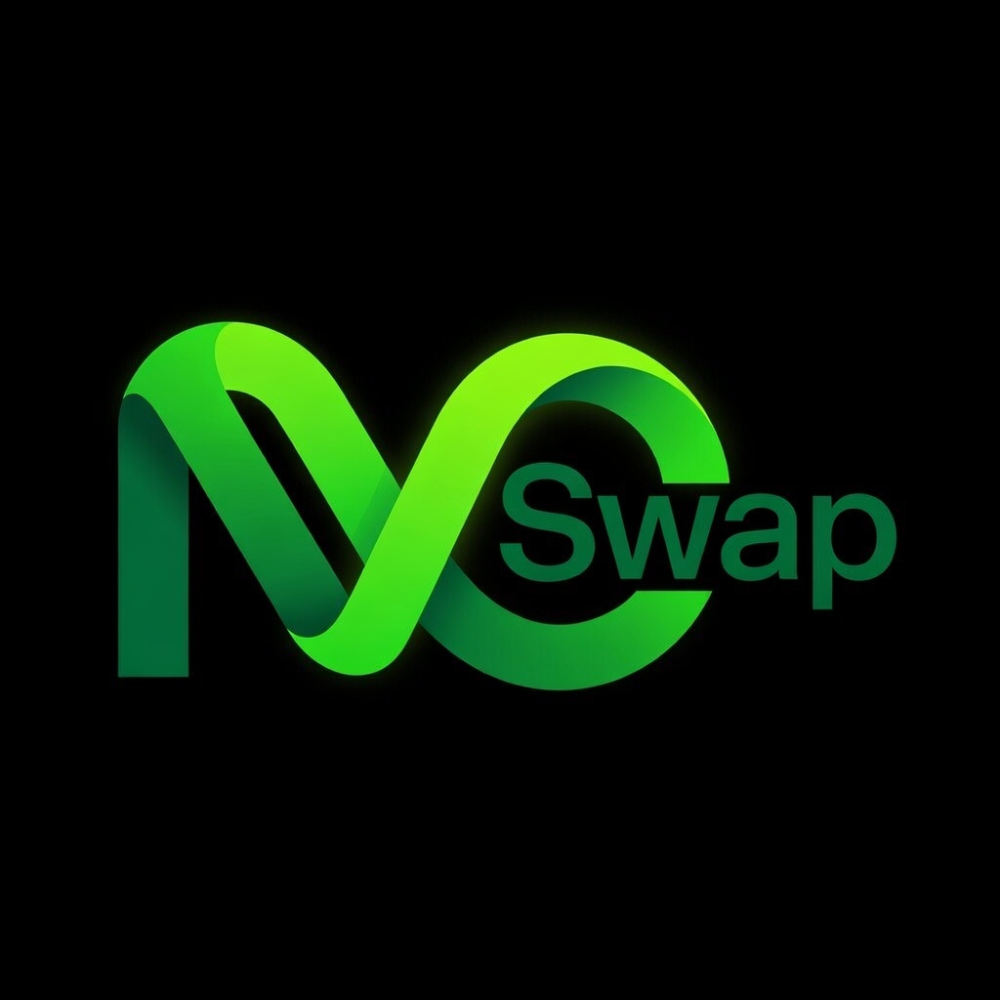

  
  
  <h1><strong>Abraham Ojabugbe</strong></h1>
  <h2><strong>Cybersecurity Engineer</strong></h2>
  
  
<em>Building secure, intelligent systems that make advanced technology practical, resilient, and trustworthy.</em>

---

## About Me

I am a Cybersecurity Engineer and founder of **Praeceptor AI**, I design and implement secure technology solutions that enable organizations and individuals to adopt emerging technologies with confidence. 

My expertise spans **AI security**, **enterprise Networking**, **secure VoIP infrastructure**, and **Blockchain systems**.

> **Mission:** Increase trust in technology through thoughtful, resilient, and secure system design.

---

## What I Do

I architect, secure, and automate modern technology platforms with a secure by design principle in the following areas:

<strong>Cybersecurity Engineering</strong>

- Security Architecture & Threat Modeling
- Secure System Design
- Security Hardening & Automation
- Defensive Security Operations

<strong>Network Engineering</strong>

- Enterprise Network Design
- Network Security & Segmentation
- Routing, Switching & Infrastructure
- Network Troubleshooting

<strong>AI Security Engineering</strong>

- Secure AI Integration
- AI Agent Security
- Intelligent Automation
- AI-powered Security Solutions

<strong>VoIP Infrastructure</strong>

- Secure VoIP Deployment
- SIP Infrastructure
- TLS & SRTP
- Centralized Management

<strong>Blockchain Engineering</strong>

- Smart Contract Integration
- Decentralized Payment Systems
- Blockchain Infrastructure

---

## Featured Projects

### Praeceptor AI
**A Smart Cybersecurity Mentor**

  

A smart, adaptive learning platform that enhances human mentorship through personalized guidance, long-term memory, and domain-specific cybersecurity knowledge. Modeled as an ex-black-hat hacker turned ethical hacker. Designed to accelerate skill development while maintaining high educational standards.

**Key Features:**
- Adaptive learning pathways
- Long-term conversational memory
- Offensive Security-focused knowledge architecture
- Intelligent mentoring system

---

### AsterOps
**Centralized Secure VoIP Infrastructure Management**

  

A centralized management system for automated deployment, management, security hardening, and auditing of VoIP infrastructure. Reduces operational risk while improving security posture and efficiency.

**Key Features:**
- Automated provisioning & deployment
- TLS & SRTP security enforcement
- Centralized management & monitoring
- Security auditing & compliance

---

### N-SWAP
**Blockchain Payment Infrastructure for Nigeria**

  

A decentralized payment solution that bridges cryptocurrency with everyday financial needs, enabling seamless crypto-to-fiat conversion and bill payments with a focus on usability and security.

**Key Features:**
- Multi-chain support
- Secure crypto-to-Naira gateway
- Bill payment integration
- Decentralized architecture

---

## Core Technologies

### Languages

### Networking & Infrastructure

### Security

### AI & Intelligent Systems

### Tools & Platforms

---

## Currently

---

## Let's Connect

I'm always interested in discussing <strong>cybersecurity</strong>, <strong>secure systems design</strong>, <strong>AI security</strong>, or potential <strong>collaboration opportunities</strong>.

 

&nbsp;&nbsp;&nbsp;

&nbsp;&nbsp;&nbsp;

---

  <strong>Building the future. Securing it by design.</strong>

